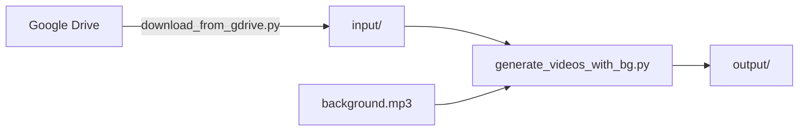

# 🎬 Video Generator - GuruGeeta Project

Automated video generation system with cloud-based processing and multi-language support. Generate 1080p videos from images and audio files with background music - all through a simple web interface!

---

## 🌐 **Web Interface (Recommended)**

### 🚀 **[Launch Video Generator →](https://srisatupasi2498.github.io/image_audio_video_maker/)**

**Click the link above to generate videos instantly - no installation required!**

### How to Use:

1. 📤 **Upload** your media files to Google Drive (see [Google Drive Setup Guide](GOOGLE_DRIVE_SETUP.md))
2. 🌐 **Visit** the [Video Generator Web App](https://srisatupasi2498.github.io/image_audio_video_maker/)
3. 🎬 **Select** language and file range
4. ✅ **Click** "Generate Videos"
5. ⏱️ **Wait** 15-25 minutes (status updates automatically)
6. 🎉 **Find videos** automatically uploaded to your Google Drive!
   - Videos appear in: `GG [LANGUAGE]/[LANGUAGE] video files/`
   - No GitHub login required!
   - Also available as artifacts (backup) for 30 days

### Supported Languages:

- 🇬🇧 English (GGENG)
- 🇮🇳 Kannada (GGKND)
- 🇮🇳 Hindi (GGHND)
- 🇮🇳 Tamil (GGTML)
- 🇮🇳 Telugu (GGTLG)
- 🇮🇳 Marathi (GGMRT)

---

## ✨ Features

- ✅ **Web-Based Interface**: Generate videos from any device with a browser
- ✅ **Cloud Processing**: Uses GitHub Actions (free for public repos)
- ✅ **Unlimited Minutes**: No time limits on public repositories
- ✅ **Google Drive Integration**: Auto-downloads media AND uploads videos
- ✅ **No GitHub Login Required**: Videos appear directly in your Google Drive
- ✅ **Multi-Language Support**: 6 Indian languages + English
- ✅ **Background Music**: Automatic mixing at 1% volume
- ✅ **1080p Quality**: Full HD output optimized for YouTube
- ✅ **Real-Time Status**: Live workflow monitoring in the UI
- ✅ **Parallel Workflows**: Run multiple generations simultaneously
- ✅ **Automatic Cleanup**: No manual file management needed

---

## 📖 Documentation

- **[Web App Guide](USER_GUIDE.md)** - How to use the web interface
- **[Google Drive Setup](GOOGLE_DRIVE_SETUP.md)** - Configure your media folders
- **[Google Drive Auto-Upload](GDRIVE_UPLOAD_SETUP.md)** - ⭐ Enable automatic video uploads
- **[Production Guide](PRODUCTION_GUIDE.md)** - Multi-project setup & advanced config

---

## 🚀 Alternative: Local Setup

> **Note:** Most users should use the [Web Interface](https://srisatupasi2498.github.io/image_audio_video_maker/) above. Local setup is for developers or advanced users who want to run the generator on their own machine.

### Prerequisites

1. **Install Python 3.11+**
2. **Install ffmpeg**
   - Mac: `brew install ffmpeg`
   - Windows: Download from [ffmpeg.org](https://ffmpeg.org/download.html)
3. **Install gdown (for Google Drive downloads)**
   - Mac: `brew install gdown`
   - Windows: `pip install gdown`

### Local Usage

1. **Clone this repository:**

   ```bash
   git clone https://github.com/srisatupasi2498/image_audio_video_maker.git
   cd image_audio_video_maker
   ```

2. **Download media files:**

   ```bash
   python3 download_from_gdrive.py --language ENGLISH --start 1 --end 10
   ```

3. **Generate videos:**

   ```bash
   python3 generate_videos_with_bg.py
   ```

4. **Find videos in:** `output/` folder

---

## đ File Structure

```
image_audio_video_maker/
├── docs/
│   └── index.html              # Web interface
├── input/
│   ├── images/                 # Downloaded images (auto-managed)
│   ├── audio/                  # Downloaded audio (auto-managed)
│   └── background/
│       └── background.mp3      # Background music (1% volume)
├── output/                      # Generated videos appear here
├── download_from_gdrive.py     # Google Drive downloader
├── generate_videos_with_bg.py  # Video generator with background music
├── config.json                 # Multi-project configuration
└── .github/workflows/
    └── generate-videos.yml     # GitHub Actions automation
```

---

## 🎯 How It Works

### Cloud Workflow (Recommended)

1. **User fills web form** → Selects language & file range
2. **GitHub Actions triggered** → Spins up macOS runner
3. **Downloads media** → From Google Drive using `gdown`
4. **Generates videos** → Using ffmpeg with background music
5. **Uploads to Google Drive** → Videos appear in language folder automatically 🎉
6. **Also creates artifacts** → Available as backup for 30 days
7. **Team accesses videos** → Directly from Google Drive (no GitHub login needed)

### Local Workflow (Developers)



---

## 📁 File Requirements

### Google Drive Folder Structure

Your Google Drive should be organized as follows:

```
Srisatupasi/
├── GG ENGLISH/
│   ├── ENGLISH jpg files/
│   │   ├── GGENG001.jpg
│   │   ├── GGENG002.jpg
│   │   └── ...
│   └── Final ENGLISH audio files/
│       ├── GGENG001.mp3
│       ├── GGENG002.mp3
│       └── ...
├── GG KANNADA/
│   ├── KANNADA jpg files/
│   │   ├── GGKND001.jpg
│   │   └── ...
│   └── Final KANNADA audio files/
│       ├── GGKND001.mp3
│       └── ...
└── (similar structure for HINDI, TAMIL, TELUGU, MARATHI)
```

### File Naming Convention

**Format:** `GG[LANGUAGE_CODE][NUMBER].[extension]`

- English: `GGENG001.jpg`, `GGENG001.mp3`
- Kannada: `GGKND001.jpg`, `GGKND001.mp3`
- Hindi: `GGHND001.jpg`, `GGHND001.mp3`
- Tamil: `GGTML001.jpg`, `GGTML001.mp3`
- Telugu: `GGTLG001.jpg`, `GGTLG001.mp3`
- Marathi: `GGMRT001.jpg`, `GGMRT001.mp3`

**Numbers:** 3 digits, zero-padded (001, 002, ..., 999)

### Supported Formats

**Images:**

- JPG, JPEG, PNG (any resolution, scaled to 1080p)

**Audio:**

- MP3, WAV, M4A, AAC (any duration/bitrate)

---

## 📹 Output Specifications

- **Resolution:** 1920x1080 (1080p Full HD)
- **Format:** MP4 (H.264 + AAC)
- **Video Codec:** H.264 with CRF 23
- **Audio:** Main audio + background music (1% volume)
- **Duration:** Matches audio file duration
- **Optimization:** Web streaming ready

---

## 💡 Tips & Best Practices

### For Best Results:

1. **Use consistent image dimensions** (1920x1080 recommended)
2. **Use high-quality audio** (192kbps+ MP3 or WAV)
3. **Number files sequentially** for easy batch generation
4. **Test with 1-2 files first** before bulk generation
5. **Monitor the workflow link** for real-time progress

### Parallel Workflows:

- ✅ **You can run multiple workflows simultaneously**
- ✅ Each workflow is tracked independently
- ✅ Downloads remain available for 30 days
- ⚠️ Be mindful of Google Drive rate limits

---

## 🛠️ Troubleshooting

### Workflow Fails with "Folder IDs not configured"

**Solution:** Update folder IDs in `download_from_gdrive.py` (see [Google Drive Setup](GOOGLE_DRIVE_SETUP.md))

### Videos Not Generating

**Possible causes:**

1. Files not found in Google Drive
2. Incorrect file naming (must match `GGXXX###` format)
3. Missing image or audio file for a number

**Check:** View workflow logs in GitHub Actions

### Download Link Not Appearing

**Solution:**

- Use the permanent "View All Workflows" link at top of web form
- Click on your specific workflow run
- Scroll to "Artifacts" section at bottom
- Download the ZIP file

---

## 📊 Technical Details

### GitHub Actions Workflow

- **Runner:** macOS (latest)
- **Timeout:** 90 minutes
- **Dependencies:** gdown, ffmpeg, Python 3.11
- **Artifact Retention:** 30 days
- **Cost:** Free (unlimited for public repos)

### Processing Time

- **Download:** ~2-5 minutes (depends on file count)
- **Video Generation:** ~1-2 minutes per video
- **Upload:** ~1-2 minutes

**Example:** 10 videos = ~15-25 minutes total

---

## 🤝 Contributing

This is a production system for the GuruGeeta project. For changes:

1. Fork the repository
2. Create a feature branch
3. Test locally before committing
4. Submit a pull request

---

## 📞 Support

- **Issues:** [GitHub Issues](https://github.com/srisatupasi2498/image_audio_video_maker/issues)
- **Documentation:** See guides in this repo
- **Web App:** [https://srisatupasi2498.github.io/image_audio_video_maker/](https://srisatupasi2498.github.io/image_audio_video_maker/)

---

## 📄 License

This project is for the GuruGeeta spiritual content initiative.

---

**Made with ❤️ for spreading spiritual knowledge**
